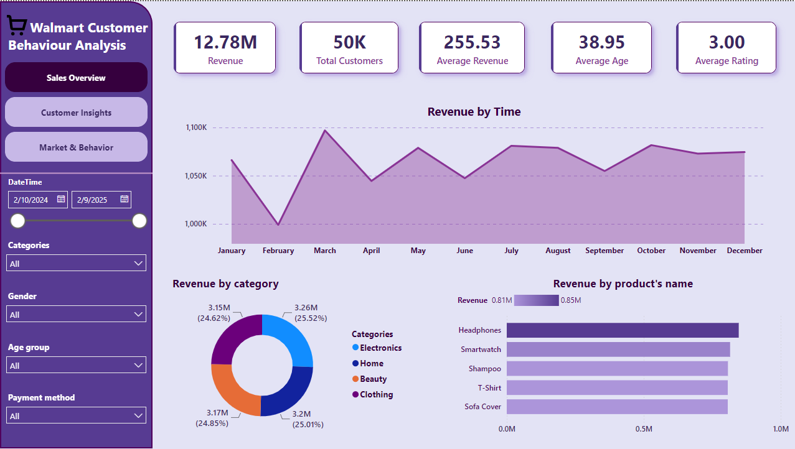

# ️🛒 Walmart Customer Behavior Analysis

A Power BI dashboard designed to visualize and monitor key sales performance metrics for a global retail company. The report helps stakeholders track business activity across stores, products, and customer segments—supporting strategic decision-making in retail operations.

## 📈 Dashboard Preview

🔗 [Link_dashboard (cần đăng nhập)](https://app.powerbi.com/links/W01RrpWyGo?ctid=06f1b89f-07e8-464f-b408-ec1b45703f31&pbi_source=linkShare)

## ️🔑 Key Features

- Time-based analysis of revenue and order volume
- Product and category performance breakdown
- City-level sales performance comparison
- Customer segmentation by age, gender, and payment preference
- Repeat customer behavior and rating analysis

## ️🔧 Tool used

- Python (pandas)
- Microsoft SQL Server
- PowerBI

## ️🔦 Step Performed

- Loaded the raw dataset into Python using Pandas for initial exploration.
- Cleaned and preprocessed the data by handling missing values, duplicates, and inconsistent data formats.
- Performed data analysis in SQL to generate aggregated metrics and answer key business questions.
- Imported the processed data into Power BI and built interactive visualizations.
- Analyzed the dashboard results to identify key trends, customer behavior patterns, and business insights.

## ️💡 Business Insights

- **Electronics products, especially headphones and smartwatches, show strong performance with high revenue and steady monthly growth**:
These products can be considered key revenue drivers and should receive more focus in marketing and product development.
- **Older customers tend to spend slightly less and give lower ratings, while female customers generally provide more positive ratings**:
Improve service quality and products tailored to older customers, while simultaneously launching loyalty programs specifically for female customers.
- **Younger customers generate the highest revenue and tend to pay by card, while older customers prefer cash on delivery**:
Offer card or e-wallet incentives to young people, while simplifying the Cash on Delivery process for older customers.
- **Cities such as New, North, Lake, and East Michael stand out as the strongest markets, with high revenue, a large number of repeat customers, and a stable order volume**:
These locations should be prioritized for business expansion, customer retention, and sales-focused initiatives.

